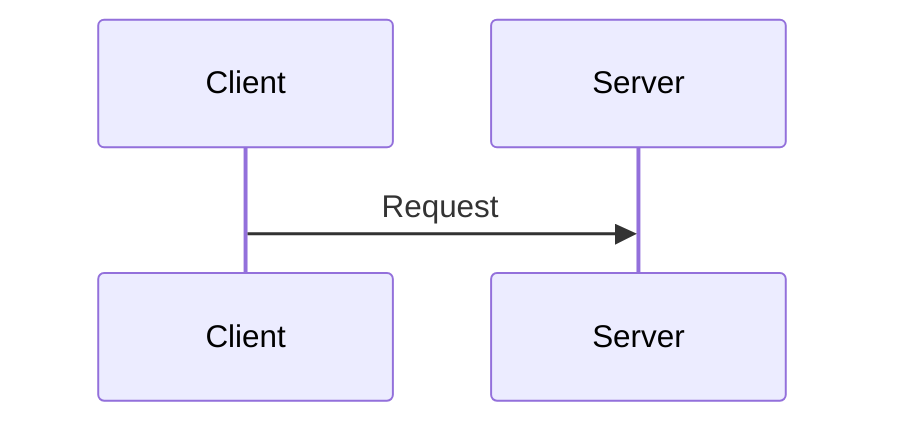

# Example

## PlantUML

```plantuml
@startuml
!theme bluegray

[Client] -> [Server] : Request

@enduml
```

## Mermaid

```mermaid
sequenceDiagram
    participant Client
    participant Server
    Client->>Server: Request
```
