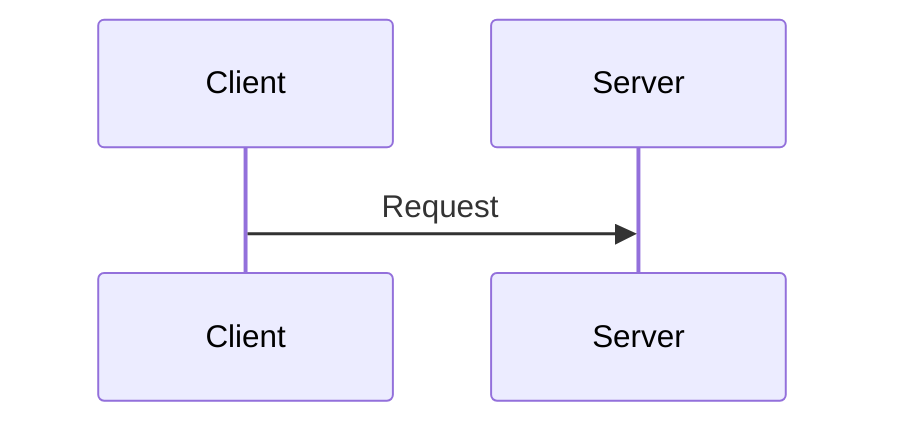

# Example

## PlantUML


### C4-PlantUML
[C4-PlantUML](https://github.com/plantuml-stdlib/C4-PlantUML) combines the benefits of PlantUML and the C4 model for providing a simple way of describing and communicate software architectures

```plantuml
@startuml Basic Sample
!include https://raw.githubusercontent.com/plantuml-stdlib/C4-PlantUML/master/C4_Container.puml

LAYOUT_LANDSCAPE()

Person(admin, "Administrator")
System_Boundary(c1, "Sample System") {
    Container(web_app, "Web Application", "C#, ASP.NET Core 2.1 MVC", "Allows users to compare multiple Twitter timelines")
}
System(twitter, "Twitter")

Rel(admin, web_app, "Uses", "HTTPS")
Rel(web_app, twitter, "Gets tweets from", "HTTPS")
@enduml
```

## Mermaid

